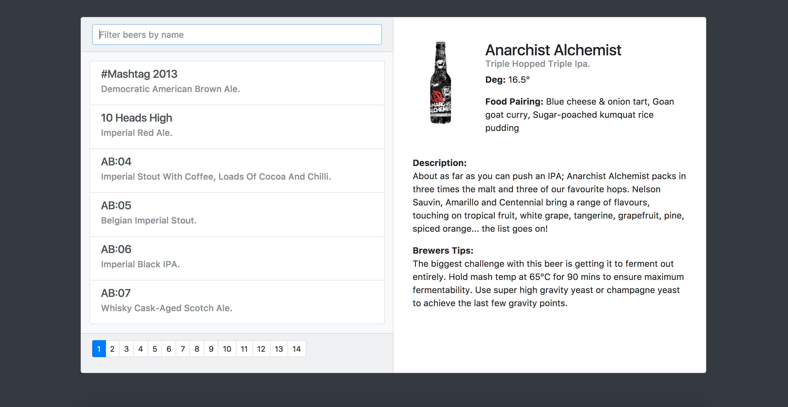

# Vue-beer

Build your first VueJs App!

## Result

The final result is composed of a paginated list of beers fetched with an HTTP request with a filter input, and a selected beer details area.

## Step 1

**Specs:**

- HTTP Request to https://api.punkapi.com/v2/beers (GET) in the home component
- Create a BeerList component that render a list of beers with the data from "home" component

**Hints**
- v-for
- vue-axios
- "mounted" hook
- dynamic attributes